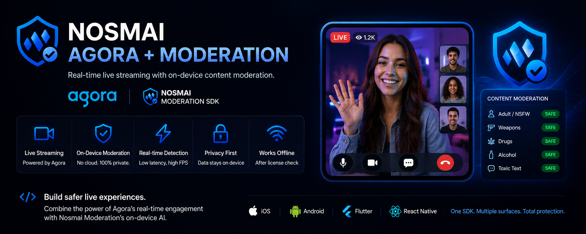

# Nosmai Moderation + Agora Example Apps

Example apps that combine **Nosmai on-device content moderation** with **Agora live streaming**. The broadcaster's camera is streamed with Agora, and every captured frame is moderated on-device by the Nosmai SDK in real time (NSFW, objects, and chat text), with no frame or message leaving the device.

```
android/   Android example (Kotlin, Jetpack Compose)
ios/       iOS example (Swift, SwiftUI)
web/       Web example (JavaScript, Vite)
```

The Android and iOS examples have two screens:

- **Live Camera Detection**: the plain on-device moderation demo (camera + verdicts + text moderation).
- **Agora Live Stream + Moderation**: Agora captures and streams the video; each frame is tapped and passed to the Nosmai SDK, so the live broadcast is moderated in real time. Includes a camera switch and a text-moderation field.

The web example is a single page: the Agora live stream with real-time moderation and a text-moderation field.

## How it works

Agora captures the camera and streams it. On mobile a raw video-frame observer taps each captured frame and forwards it to `NosmaiSDK.pushFrame(...)`; on web the same local track feeds `NosmaiModeration.analyzeImage(...)`. The SDK runs detection and reports the verdict (SAFE / UNSAFE) live. Nothing about the moderation leaves the device; only Agora's own media transport uses the network.

## Prerequisites

- A **Nosmai Moderation** license key, registered for the example's bundle id / package name at https://nosmai.com/. The license and its encrypted models come with the SDK.
- An **Agora** App ID and a temporary token (Agora Console), or a token server.
- The **Nosmai Moderation SDK**:
  - Android: `nosmai-detection.aar` (from the Android SDK release) in `android/app/libs/`.
  - iOS: the `NosmaiModerationSDK` CocoaPods pod. It ships the SDK framework and its encrypted models. Requires [CocoaPods](https://cocoapods.org/).
  - Web: the `@nosmai/moderation-web` npm package, plus the encrypted model files in `web/public/models/`. Requires [Node.js](https://nodejs.org/) 18+.

## Setup

Replace the placeholders before running.

**Android** (`android/app/src/main/java/com/example/nosmaidetectiondemo/`)

- `MainActivity.kt` and `AgoraStream.kt`: set your `NOSMAI-XXXX` license key.
- `AgoraStream.kt`: set `YOUR_AGORA_APP_ID`, `YOUR_CHANNEL_NAME`, and `YOUR_AGORA_TOKEN`.
- Put `nosmai-detection.aar` in `android/app/libs/`.
- Run: open `android/` in Android Studio, or `./gradlew installDebug` (arm64 device).

**iOS** (`ios/`)

- Install the SDK pod (ships the framework + encrypted models):

  ```sh
  cd ios
  pod install
  ```

- Open **`ios/NosmaiDetectorDemo.xcworkspace`** (not the `.xcodeproj`). Xcode resolves the Agora Swift Package (`AgoraRtcEngine_iOS`) on open.
- `NosmaiDetectorDemo/CameraManager.swift` and `AgoraStreamManager.swift`: set your `NOSMAI-XXXX` license key.
- `AgoraStreamManager.swift`: set `YOUR_AGORA_APP_ID`, `YOUR_CHANNEL_NAME`, and `YOUR_AGORA_TOKEN`.
- Run on a real device (the SDK is arm64-only).

**Web** (`web/`)

- Install and run:

  ```sh
  cd web
  npm install
  npm run dev
  ```

- Put the encrypted model files in `web/public/models/` (`nsm_nsfw.onnx`, `nsm_detector.onnx`, `nsm_text.onnx`, `vocab.txt`).
- Copy `web/.env.example` to `web/.env.local`, then set `VITE_NOSMAI_LICENSE_KEY`, `VITE_AGORA_APP_ID`, `VITE_AGORA_CHANNEL`, and `VITE_AGORA_TOKEN`.
- See `web/README.md` for details.

> The Agora temporary token expires (about 24 hours). If you see Agora error 109, regenerate the token.

## License

The example code in this repository is MIT (see [LICENSE](LICENSE)). The Nosmai Moderation SDK and its models are proprietary and require a license key; Agora is a separate commercial SDK.
